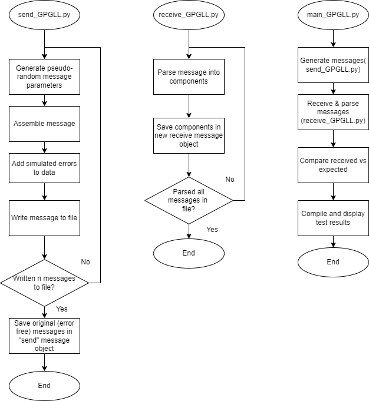

# GPS GPGLL Sender & Receiver
## Design
There are two components in this GPGLL handler. The Sender generates random GPGLL messages (some of which are invalid by design - simulating errors during transmission), and the Receiver parses those messages back into a data struct. Simple tests then compare the expected (sent) data with the received data and compiles test results. The level of random error generation is tunable, as is the number of messages to generate and test. They can be changed using the ERROR_THRESHOLD and NUM_MESSAGES values in the main file.

The GPGLL message format reference is from [here](https://www.rfwireless-world.com/Terminology/GPS-sentences-or-NMEA-sentences.html).



## Install & Run
There are no external dependencies to install. The script can be run quickly:
```
git clone git@github.com:tganley/GPS_SendReceive.git
python3 main_GPGLL.py
```